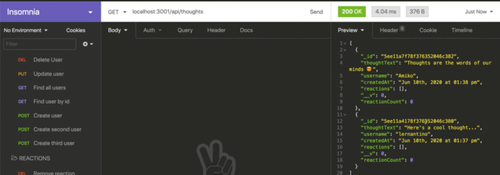

# Social-Network-API

## Description
A social network web application where users can share their thoughts, react to friends’ thoughts, and create a friend list

* GIVEN a social network API
* WHEN I enter the command to invoke the application
* THEN my server is started and the Mongoose models are synced to the MongoDB database
* WHEN I open API GET routes in Insomnia for users and thoughts
* THEN the data for each of these routes is displayed in a formatted JSON
* WHEN I test API POST, PUT, and DELETE routes in Insomnia
* THEN I am able to successfully create, update, and delete users and thoughts in my database
* WHEN I test API POST and DELETE routes in Insomnia
* THEN I am able to successfully create and delete reactions to thoughts and add and remove friends to a user’s friend list

## Installations
 * MONGOOSE
 * EXPRESS
 * NODEMON

 ## Usage
To start, you will need to use the command node index in the terminal to connect to MondgoDB. Once there, you will be able to get and add to your database. You can also see and test your CRUD routes by using Insomnia.

  * Video Link: https://drive.google.com/file/d/1LdwzQM66vowCXzuare284KB_vMHe0uvO/view 

 ## Screenshot

## License
MIT

## Github Link
https://github.com/JennaJay/Social-Network-API 

